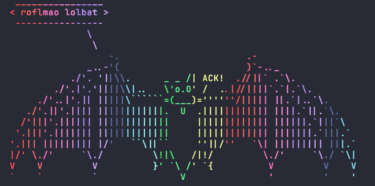

# lolbat

Colorize terminal output using the [Dracula](https://draculatheme.com) color palette.

A lolcat-compatible CLI tool with three coloring modes. See the [demo](demo.md) for visuals.

## Usage

    lolbat [options] [file ...]
    command | lolbat [options]

## Options

    --mode      sequential|sine|random (default: sequential)
    --freq      Color wave frequency, sine mode only (default: 0.3)
    --spread    Characters per color step (default: 3.0)
    --seed      Starting palette offset (default: 0)
    -a          Animate colors

## Install

    go install github.com/jamesfishwick/lolbat@latest

## Development

    make setup   # install pre-commit hook
    make lint    # run go vet + golangci-lint
    make test    # run tests with race detector
